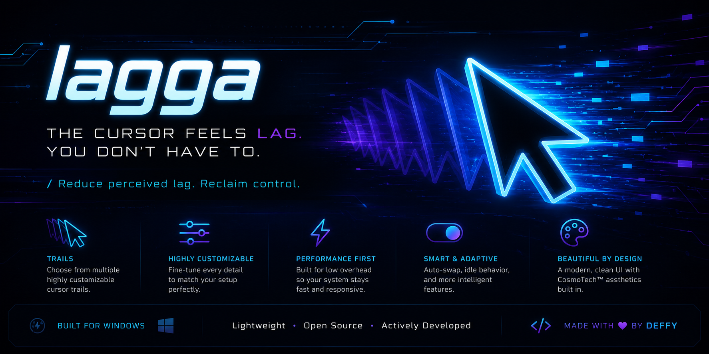
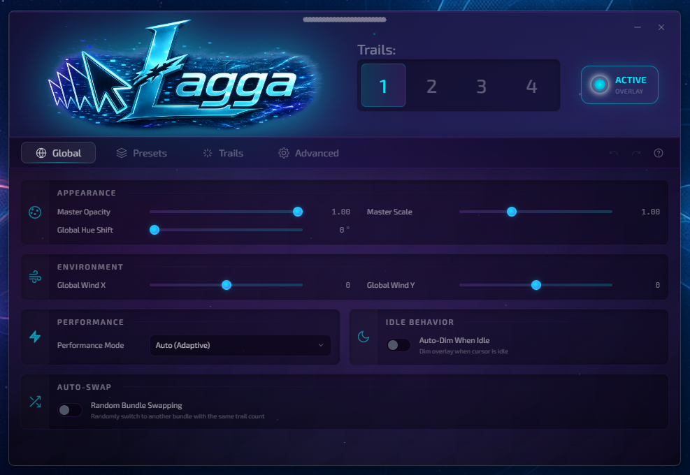

# Lagga



**High-fidelity, physics-driven mouse trail overlay for Windows.**

Turn your cursor into a living, reactive visual system. Lagga is a production-grade desktop overlay featuring deep spring-leash physics, multi-trail orchestration, procedural textures, advanced particle behaviors, and an energy-coherent preset system — all rendered at high fidelity with minimal overhead.

Built with Tauri 2, React, and Canvas 2D. Designed for streamers, power users, and anyone who wants their desktop presence to feel *alive*.



---

## Features

### Core Experience
- **Up to 4 independent trails** with individual enable/disable and per-trail configuration
- **Advanced spring-leash physics** — stiffness, damping, inertia, friction, spring tension, gravity (with angle & falloff), wind, turbulence, and orbital attraction
- **Rich particle & visual systems** — glowing orbs, dots, lines, ribbons, plasma, fireflies, spirals, and more
- **Multiple color modes** — static, gradient, velocity-reactive, rainbow, palette cycling, and pulsing
- **Procedural texture overlays** — nebula noise, starfield, energy filaments, constellations, vortex, and aurora veil
- **Advanced behaviors**:
  - Afterimages & trail echoes
  - Click gravity wells
  - Breathing orbs
  - Comet mode
  - Magnetic repulsion between trails
  - Random bursts
  - Nexus & persist-on-click modes
  - Velocity-based thickness
- **Idle system** — automatic patterns (orbit, figure-8, spiral, bounce) with configurable timeout and auto-dimming

### Presets & Generation
- 16 curated individual presets across distinct energy archetypes (ethereal, aggressive, cyber, organic, luminous, void, minimal, chaotic)
- 9+ hand-crafted multi-trail bundles
- **Energy-coherent random bundle generator** — produces aesthetically intentional combinations instead of random noise
- Real-time preview + one-click application

### Polish & Production
- Global controls (master opacity, scale, hue shift, global wind)
- Performance modes (Auto-Adaptive, Quality, Balanced, Performance)
- Built-in diagnostics & health scoring (frame timing, stalls, input latency)
- Session metrics (distance traveled, clicks, peak speed, uptime)
- Auto-swap between bundles
- Full undo/redo history in the configuration UI
- Clean, borderless cyber-cosmic interface

### Technical
- True global cursor tracking (Windows) via native polling
- Click-through transparent overlay window(s)
- Always-on-top enforcement + multi-monitor support
- Low GC pressure via object pooling
- Debounced settings synchronization between config UI and overlay
- System resource monitoring (CPU + memory)

---

## Screenshots

**Main Configuration Interface**


**Trail Physics & Visual Controls**


**Preset & Bundle Gallery**


*(Add your own high-quality screenshots to `assets/` for the best presentation.)*

---

## Installation

### Pre-built Releases (Recommended)

1. Download the latest `.exe` installer from the [Releases](https://github.com/yourusername/lagga/releases) page.
2. Run the installer.
3. Launch **Lagga** from the Start Menu or desktop shortcut.

The overlay starts hidden. Open the main window to configure and toggle the overlay on.

### Building from Source

#### Prerequisites
- [Rust](https://www.rust-lang.org/tools/install) (latest stable)
- [Node.js](https://nodejs.org/) ≥ 20
- [pnpm](https://pnpm.io/) or npm
- Windows SDK (for full native features)

#### Steps

```bash
# Clone the repository
git clone https://github.com/yourusername/lagga.git
cd lagga

# Install frontend dependencies
npm install

# Run in development mode (opens config UI + starts overlay)
npm run tauri dev
```

#### Production Build

```bash
npm run tauri build
```

The installer and portable binary will be generated in `src-tauri2/target/release/bundle/nsis/`.

> **Note**: The Tauri backend lives in `src-tauri2/`. The frontend is a standard Vite + React + TypeScript project at the root.

---

## Usage

1. Launch Lagga.
2. The main window opens with the **Global** tab.
3. Configure master settings (opacity, scale, performance mode, etc.).
4. Switch to the **Trails** tab to customize individual trails (or use **Presets** for instant results).
5. Toggle **ACTIVE OVERLAY** in the top right.
6. Move your mouse — the trails react in real time.
7. Click anywhere to create temporary gravity wells (if enabled on a trail).

The overlay is fully click-through and stays on top of other windows.

**Pro tip**: Use the random bundle generator when you want fresh cosmic energy without manual tuning.

---

## Deep Customization

Lagga exposes an unusually deep parameter space while remaining usable:

### Per-Trail Physics
- Leash length, stiffness, damping, gravity, wind, turbulence, inertia, friction, spring tension, orbital attraction, velocity decay

### Visuals
- Particle count & variance, orb radius, size range & curve, glow, bloom, trail length/width/fade, render mode, texture overlay, opacity

### Color & Animation
- Primary/secondary/tertiary colors, color mode, cycling, cycle speed, hue shifting (global)

### Behavior
- Mouse velocity influence, random bursts, cross-trail sync, persist on click, velocity thickness, nexus mode, comet mode, magnetic repulsion, trail echo, breathing, gravity wells on click

### Idle
- Timeout, orbit speed, idle motion pattern

All changes are live-synced to the overlay with minimal latency.

---

## Technical Architecture

```
┌─────────────────────┐
│   Main Window       │  React + Zustand + Custom Cosmo UI
│   (Config + Presets)│
└──────────┬──────────┘
           │ Tauri Commands + Events
           ▼
┌─────────────────────┐
│   Rust Backend      │  Global cursor polling (Win32)
│   (src-tauri2/src)  │  Window management, metrics, multi-monitor
└──────────┬──────────┘
           │ Tauri Events ("cursor-move", "cursor-click", "settings-changed")
           ▼
┌─────────────────────┐
│   Overlay Window(s) │  Transparent, click-through, always-on-top
│   Canvas 2D + Sim   │  Spring physics, particle pools, procedural textures
└─────────────────────┘
```

- **State**: Zustand stores with persistence, undo/redo snapshots, and debounced overlay emission.
- **Rendering**: High-performance Canvas 2D with texture caching and object pooling.
- **Input**: Native Windows cursor polling at ~200 Hz for buttery responsiveness.
- **Performance**: Frame health scoring, stall detection, adaptive quality hints.

---

## Roadmap

- [ ] Full Linux support (global cursor tracking via evdev / X11 / Wayland)
- [ ] WebGPU renderer option for extreme particle counts & post effects
- [ ] Preset export/import + community sharing format
- [ ] "Singularity Mode" — meta-trail linking & cross-trail resonance
- [ ] macOS support (Apple Silicon)
- [ ] Tray icon + quick toggle actions
- [ ] Plugin API / IPC hooks for other tools

---

## Contributing

Contributions are welcome, especially:

- Linux/macOS input backends
- New render modes or texture generators
- Performance optimizations
- UI/UX refinements
- Documentation & preset curation

Please open an issue first for larger changes so we can align on direction.

---

## Philosophy

Lagga was built as a **living desktop entity** — not just visual decoration, but a reactive extension of presence. The same philosophy that drives deep systems work, mythic worldbuilding, and cognitive externalization.

Every trail is a tethered companion. Every gravity well is you reaching into the simulation. The coherent random generator exists because true chaos should still feel intentional.

---

## License

This project is licensed under the **MIT License** — see the [LICENSE](LICENSE) file for details.

You are free to use, modify, and distribute Lagga for personal and commercial purposes.

---

## Credits

- Built with [Tauri 2](https://tauri.app/), [React](https://react.dev/), [Vite](https://vitejs.dev/), and [Zustand](https://zustand-demo.pmnd.rs/).
- Cursor tracking powered by the Windows API.
- Special thanks to everyone pushing the boundaries of what a desktop can *feel* like.

---

**Lagga** — Turn movement into myth.

Made with precision and cosmic intent.

---

> **Repository Structure Note**  
> The Tauri backend is located in `src-tauri/`. Frontend source lives in `src/`. This layout supports clean separation while keeping a standard Vite root.

If you build something beautiful with Lagga, tag it. We’d love to see what the signal becomes in your hands.

x Ðeffy Urz
